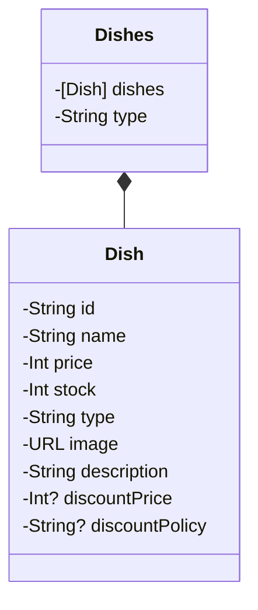

# SideDish - iOS

## Flow

---

---
## Model

## View

#### ~ 22.4.20
- 요약 화면
    - 반찬리스트 뷰 구현
    - 반찬리스트 헤더 구현
    - 반찬리스트 셀 구현
- 상세화면 
    - 요리 요약 뷰 구현
    - 배송 정보 뷰 구현

## Network

## 실행화면
<table>
    <tr>
<td></td><td></td>
    </tr>
</table>

