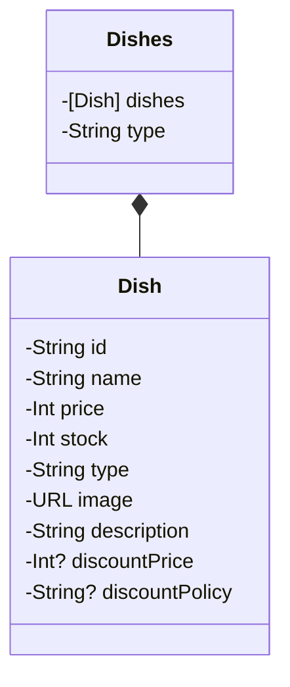

# SideDish - iOS

## Flow

---
## Model

#### ~22.4.27

- 구조개선 및 리팩토링
  - 수량 버튼 로직 변경(PropertyWrapper didSet 활용)
  - SwiftLint 적용 및 컨벤션에 맞게 코드 수정
  - 뷰 용도에 따른 폴더 분류(Common/Brief/Detail)
  - UIFont extension으로 사용자 정의 폰트 작성
  - UIStackView에 customStackView extension 구현
  - 반찬 MockData 생성 및 뷰와 연결
  - 가격을 포맷에 맞게 출력하는 Int extension 추가
  - 상세화면 반찬 뷰 모델 생성
- 기능 추가
  - 목데이터 생성
  - 이미지를 비동기로 다운로드하는 로직 추가
  - 수량 조절 버튼 터치시 상품가격과 수량을 계산하여 총금액 표시하는 로직 추가
- 뷰모델 뷰 연결
  - NotificationCenter 사용 하여 `수량버튼 - 뷰모델 - 총주문금액` 연결

## View

#### ~ 22.4.20
- 요약 화면
    - 반찬리스트 뷰 구현
    - 반찬리스트 헤더 구현
    - 반찬리스트 셀 구현
- 상세화면 
    - 요리 요약 뷰 구현
    - 배송 정보 뷰 구현

#### ~22.4.27

- CustomLabel 클래스 생성
- BanchanBriefView 생성하여 재활용
- 수량 조절 버튼 UIButton -> UIStepper로 변경
- DetailViewBorder 구현
- 이미지 cornerRadius 변경

#### 뷰 레이어

## 

## Network

-

## 고민과 해결

- extension을 너무 많이 사용하는것 같다는 생각을 하게되어 customLabel을 커스텀 뷰로 변경.
- 반찬리스트 화면과 반찬상세 화면에서 폰트의 크기만 다르고 동일하게 사용할 수 있는 뷰가 있다고 생각, BanchanBriefView 라는 커스텀 뷰를 만들고 각 화면의 타입정보를 받아서 폰트만 설정해 주는 방식으로 구현
- 뷰의 구조를 개선하면서 커스텀뷰를 여러개 만들게 되어 커스텀뷰가 많아지다보니 `뷰 - 뷰모델` 간의 데이터 전달을 어떤 방식으로 해야 효율적일지 고민했고, NotificationCenter를 통해 `뷰 - 뷰모델` 데이터 전달.

## 실행화면
<table>
    <tr>
<td></td><td></td>
    </tr>
</table>

